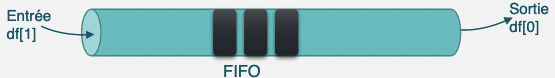
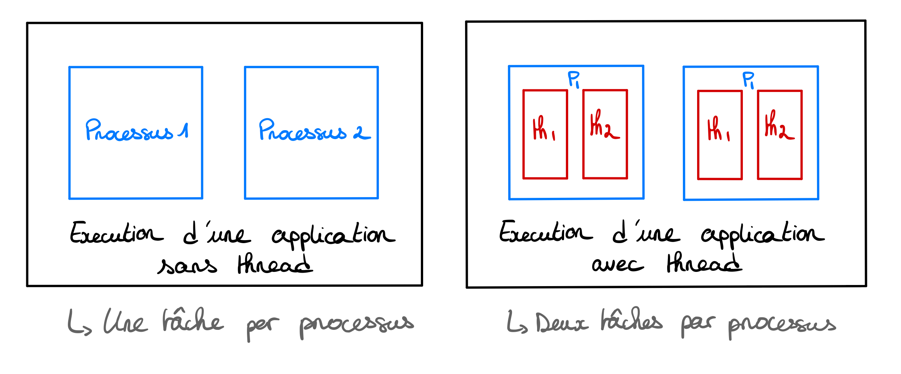
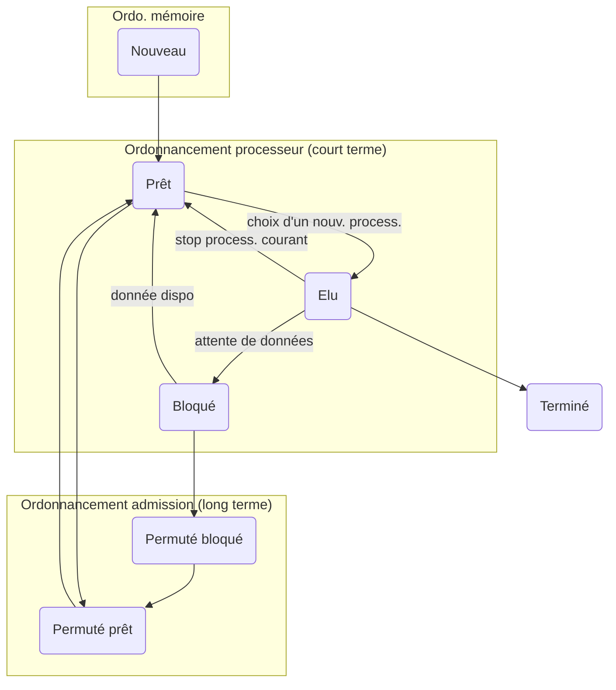
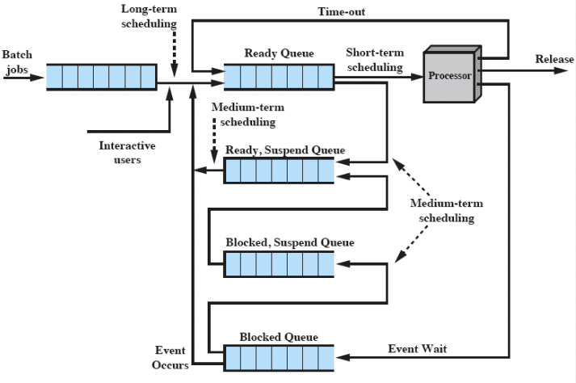

# Systèmes d'exploitation

## Tables des matières
  - [Introduction](#introduction)
  - [Concurence et Exclusion mutuelle](#concurence-et-exclusion-mutuelle-cf-tp2-td2)
  - [Communication inter-processus](#communication-inter-processus-cf-tp3-td3)
  - [POSIX et threads](#threads-et-posix-cf-tp4)
  - [Ordonnancement](#ordonnancement-cf-tp5-td4)
  - [Gestion mémoire](#gestion-mémoire-td5)

## Introduction

Un système d'exploitation est le plus important des programmes systèmes. Il permet le contrôle des ressources de l'ordinateur et de libérer le programmeur de la complexité du matériel. \
Il est composé de :
   
   - **Du noyau *(Kernel)***, partie la plus critique de l'OS, il permet au hardware et au software de communiquer ensemble, c'est donc le premier logiciel chargé en mémoire.
   - **Des outils système**, partie permettant à l'utilisateur de tirer profit de l'OS, ils fournissent une interface d'accés au système.


Les OS permettent de répondre à deux besoins :

   1. En tant que ***machine étendu (ou machine virtuelle)*** :
      
        Dans ce cas l'OS correspond à l'interface graphique qu'on peut utilisé avec Linux ou MacOS qui faire le lien entre les applications et le hardware.
        Dans le cadre de la programmation, elle sera plus simple grâce à des *appels système* ou avec des commandes *Shell* dans un terminal.
   

   2. En tant que ***gestionnaire de ressource*** :
        Dans ce cas l'OS permet d'ordonnancer et contrôller l'allocation des ressources entre les différent programmes. Les tâches les plus importante sont le partage des ressources et la protection de l'accès aux ressources

Pour résumé, les fonctions de base d'un système d'exploitation :

   - La gestion des processus
   - La gestion de la mémoire
   - Le système de fichiers
   - Les entrées-sorties


## Concurence et Exclusion mutuelle - *cf [TP2](https://git.roudaut.xyz/ensta/depot-ensta-c/-/tree/SA3/OS/TP/TP2) & [TD2](https://git.roudaut.xyz/ensta/depot-ensta-c/-/blob/SA3/OS/TD/TD2/td2.md)*

L'exclusion mutuelle a pour but de **limiter l'accès** à une ressource pour un certain nombre de processus. \
Par exemple le problème du lecteur/rédacteur, il est important que les processus lecteur n'ont pas accès au fichier pendant qu'un processus rédacteur l'utilise. \
C'est ce qu'on appel une **section critique** où il y a un **accès concurrents**. \
Il est important d'avoir un **mécanisme d'exclusion mutuelle** dans ce genre de cas, les ressources partagées au sein d'un OS ne peuvent être accédées qu'en exclusion mutuelle. 


### **Exclusion mutuelle par attente active:**
      
 1. Le masquage des interruptions \
 &rarr; Masquage des interruptions *(également l'interruption horloge)* donc le processeur ne peut plus être alloué à un autre processus. Si on les réactive pas le système est mort.

 2. Les variables de verrouillage \
 &rarr; Variable qui doit être lu/modifié avant/après d'être entré/sortie dans le processus, le temps de prise en compte du changement de valeur peut mener à des incohérence dans le programme.

 3. L'alternance \
    &rarr; Variable qui doit être lu/modifié avant/après d'être entré/sortie dans le processus, mais sont utilisation peut bloqué un processus dû au temps de changement de la variable entre les deux processus.

 4. L'instruction *TSL (Test and Set Lock)*   


### **Exclusion mutuelle sans attente active:**
Pendant une exclusion mutuelle sans attente active, le processeur exécute une boucle infinie jusqu’à ce qu’il soit autorisé à entrer en section critique ce qui consomme beaucoup de temps processeur, ce qui doit être évité.
Pour éviter l'exclusion mutuelle sans attente active il existe les primitives IPC *(Inter Process Communication)* qui bloque le processus au lieu de faire perdre du temps au processeur :
 - Les primitives `sleep()` et `wakeup()`.
 - Les sémaphores
      


### Les primitives `sleep()` et `wakeup()`

1. `sleep()`: \
   La primitive `sleep()` permet d'endormir le processus appelant.

2. `wakeup()`: \
   La primitive `wakeup(processus)` permet de réveiller le processus "`processus`"

Cette méthode peut causer des incohérences dans le programme. \
Si le système décide d'endormir le *processus1*, le *processus2* ce réveil puis s'endort. Mais si le *processus1* n'a pas eu le temps de s'emdormir avant que le *processus2* réveil le *processus1*, alors le signal *wakeup* sera perdu et les deux processus s'endormiront sans jamais se réveiler. \
Le problème est dû au temps de réalisation du programme.


### Les sémaphores
Un sémaphore est un mécanisme empêchant deux processus ou plus d’accéder simultanément à une ressource partagée. \
L’accès à un sémaphore se fait généralement par deux opérations :
- `P()` pour l’acquisition en néerlandais: Proberen, tester.
- `V()` pour la libération: Verhogen, incrémenter

Il existe deux types de sémaphores :
1. **Le sémaphore binaire :**
   - Si le sémaphore vaut 0 il est vérrouillé/occupé 
   - Si le sémaphore vaut 1 il est déverrouillé/libre
   - ---
   - Donc :
      - A l'appel de `P()`, si la valeur du sémaphore est supérieur à 0, il y a des ressources disponnibles, le processus peut alors poursuivre sont execution et on décrémente la valeur du sémaphore. \
      Sinon si la valeur du sémaphore vaut 0, il n'y a plus de ressources disponnibles, le processus est mis dans la file d'attente
      - A l'appel de `V()`, si il n'y a pas de processus dans la file d'attente, la valeur du sémaphore est incrémenté comme un processus à été libérer. \
      Sinon le processus en file d'attente prend la place du processus qui vient de finir et s'éxecute.
 
2. **Le sémaphore général :** \
Un **sémaphore général** peut avoir un très grand nombre d’états car il s’agit d’un compteur qui :
   - Décroît d’une unité à l'appel de `P()`
   - Croît d’une unité à l'appel de `V()`
   - S'il vaut 0, un processus tentant de l’acquérir doit attendre qu’un autre processus ait augmenté sa
   valeur car il ne peut jamais devenir négatif.


## Communication inter-processus - *cf [TP3](https://git.roudaut.xyz/ensta/depot-ensta-c/-/tree/SA3/OS/TP/TP3) & [TD3](https://git.roudaut.xyz/ensta/depot-ensta-c/-/blob/SA3/OS/TD/TD3/td3.md)*

### Les files de messages
Les files de messages permettent aux processus de s'échanger des informations grâce aux opérations *send* et *recieve*. Les messages envoyés peuvent être de taille variable ou fixe, de manière directe ou indirecte *(en passent par une boite aux lettres)*, de manière synchrone ou asynchrone.

### Les segments de mémoires partagée
Le principe est que les processus partagent des pages physiques par l'intermédiaire de leur espace d'adressage. L'avantage est que les informations ne sont pas en double *(contrairement aux files de messages)* comme l'information est partagée, mais dans ce cas c'est une **section critique**: Il faut utiliser un mécanisme d'exclusion mutuelle.

Pour mettre en œuvre les segments de mémoires partagée sous *UNIX* il est important de créer le segment à l'exterieur de l'espace d'adressage des processus, soit par un autre processus. Par la suite, chaque processus voulant accéder au segment doit attacher le segment à son propre espace d'adressage. \

### Les tubes
Un tube est un mécanismes de communication appartenant au système de gestion de fichiers. Leurs utilisations dans un processus ce fait par des descripteurs de fichier et à l'appel des primitives *read* et *write*.  

Métaphoriquement on peut réelement voir cela comme un tube :
- On à une entrée *(&rarr; 1)* et une sortie *(&rarr; 0)*.
- Unidirectionnels comme il n'y a qu'une entrée/sortie
- Si on stock pas l'information de sortie elle est perdu, l'information est sortie du tube.
- La première information qui rentre est la première qui sort *(FIFO)*




### Les signaux

Les signaux fonctionne en quelque sorte comme des interruptions, le *processus 1* peut envoyer un signal aux *processus 2* de finir sont travail. Mais ce signal n'est pas forcément reçus ou pris en compte et on ne peut pas non plus connaitre l'emetteur. \
Il existe différent type de signaux et certains peuvent être fatal pour le processus courant :


Signal | N°  | Commentaires 
--- |---| ----------------------------------
```SIGHUP```  | 1 | Signal émis lors d’une déconnexion
```SIGINT```  | 2 | Il est émis à tout processus associé à un terminal de contrôle quand on appuie sur la touche d’interruption ‘Ctrl-C’.
```SIGQUIT``` | 3 | Semblable à SIGINT mais le signal est émis quand on appuie sur la touche d’abandon (normalement ‘Ctl-\’).
```SIGILL```  | 4 | Instruction illégale.
```SIGFPE```  | 8 | Erreur de calcul flottant.
```SIGKILL``` | 9 | C’est la seule manière absolument sûre de détruire un processus, puisque ce signal est toujours fatal.
```SIGALRM``` | 14 | Signal émis par alarm(int sec) au bout de sec secondes.
```SIGTERM``` | 15 | Terminaison logicielle. Il s’agit du signal standard de terminaison.
```SIGUSR1``` | 16 | Premier signal à la disposition de l’utilisateur.
```SIGUSR2``` | 17 | Deuxième signal à la disposition de l’utilisateur.
```SIGCHLD``` | 18 | Ce signal est envoyé au père à la terminaison d’un processus fils.

Le principe de fonctionnement est simple, on envoie le signal à un processus *(avec `kill()`)* et celui-ci fait l'action lié à ce signal. \
Dans le cas où l'on veut modifier le comportement du processus à la reception du signal, c'est possible. Par exemple pour le signal `SIGKILL`, si on veut que le processus se détruise et qu'il affiche en plus *"je suis détruis"*. Il faut faire appel à la fonction signal pour reécrire le *handler* associé à ce signal. \


## Threads et POSIX - *cf [TP4](https://git.roudaut.xyz/ensta/depot-ensta-c/-/tree/SA3/OS/TP/TP4)*

### Les threads

Le **multithreading** permet d'effectuer plusieurs tâches dans un seul processus, ce qui permet de gagner du temps puisque les tâches sont executé en parallèles :




De plus, entre deux processus les informations ne sont pas partagés par défaut. Alors qu'avec deux threads au sein d'un même processus ils peuvent accéder aux même informations en veillant à utiliser un mécanisme d'exclusion mututelle à l'aide de fonction *POSIX*.

### POSIX
POSIX pour *Portable Operating System Interface X(UNIX)* est une norme pour interfacer les applications avec les OS *(en gras les fonctions utilisées en TP)*:

Groupe fonctionnel | Quelques fonctions principales
--- | ----------------
Multi-Threads | **pthread_create, pthread_exit, pthread_join**, pthread_detach, pthread_equal, pthread_self
Ordonnancement de processus et de Threads | sched_setscheduler, sched_getscheduler, sched_setparam, sched_getparam, pthread_getschedparam, pthread_setschedprio, etc...
Signaux temps réel | **sigqueue**, pthread_kill, **sigaction**, sigaltstack, sigemptyset, etc...
Synchro. et comm. inter-processus | mq_open, mq_close, mq_receive, sem_init, sem_open, sem_wait, **pthread_mutex_init, pthread_mutex_destroy, pthread_cond_init**, shm_open, shm_unlink, mmap, etc...
Données spécifiques aux threads | pthread_key_create, pthread_get_specific, etc...
Gestion Mémoire | mlock, mlockall, munlock, munlockall, mprotect
E/S Async | aio_read, aio_write, aio_error, aio_return, aio_fsync, etc...
Horloges et minuteries (timers) | clock_gettime, clock_settime, clock_getres, times_create, timer_gettime, etc...
Annulation | pthread_cancel, pthread_setcancelstate, pthread_cleanup_push, pthread_cleanup_pop

Avec la norme POSIX il est possible de mettre en œuvre les différentes notions vus précédement: Les sémaphores, les mutex, les variabls de conditions, les signaux, les files de messages, la mémoire partagée, l'ordonnancement...

## Ordonnancement - *cf [TP5](https://git.roudaut.xyz/ensta/depot-ensta-c/-/tree/SA3/OS/TP/TP5) & [TD4](https://git.roudaut.xyz/ensta/depot-ensta-c/-/blob/SA3/OS/TD/TD4/td4.md)*

Le rôle de l'ordonnanceur est de décider dans qu'elle état doivent se trouver les processus qui s’exécutent sur le CPU, il décide donc de l'ordre et de la durée d'éxecution. \
Un bon ordonnanceur doit :
 - Maximiser le temps d'utilisation du processeur à 100%
 - Être équitable envers les autres processus (sinon problème de **famine**)
 - Présenter un temps de réponse acceptable
 - Avoir un bon rendement/débit
 - Faire attention à la priorité des processus
 - Minimiser le temps de réponse pour les utilisateurs en mode interactif et en batch
flowchart LR

Ordonnancement à 3 niveaux :





Les ordonnanceurs doivent être adapté en fonction de l'utilisation :

1. Ordonnancement Batch: \
   Pas d'utilisateur devant l'écran donc non préemptifs, le changement de processus peut être réduit pour maximiser le nombre de job par heure, maximiser l'utilisation du CPU, minimiser le temps de rotation pour réduire la soumission et la complétion, chaque processus doit avoir accès au CPU de manière équitable.
   
   Exemple :
   - FCFS *(First come, first served)*
   - SPN *(Shortest Process Next)*
   - HRRN *(Highest Response Ratio Next)*
  

2. Ordonnancement interactif: \
   Il faut une réactivité importante pour pas que l'utilisateur et à attendre devant l'écran donc préemption, maximiser l'utilisation du CPU, chaque processus doit avoir accès au CPU de manière équitable.
   
   Exemple :
   - RR *(Round Robin ou Tourniquet)*
   - SRT *(Shortest Remaining Time)*
   - FB *(FeedBack)*

## Gestion mémoire - *[TD5](https://git.roudaut.xyz/ensta/depot-ensta-c/-/blob/SA3/OS/TD/TD5/td5.md)*

