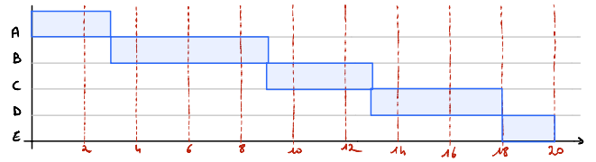
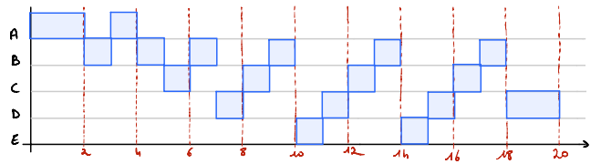
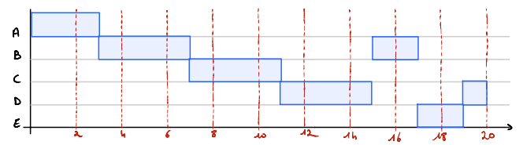
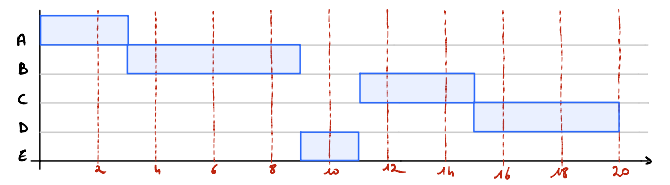
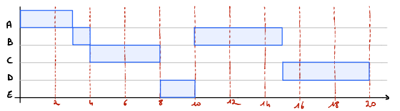
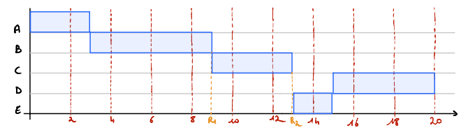
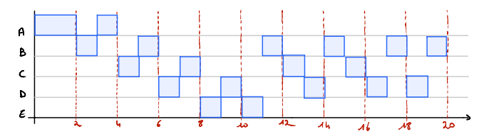

# TD4 - Ordonnancement

## FCFS *(First come, first served)*

  
&darr;&rarr;| A | B | C | D | E | Moyenne
 --- | --- | --- | --- | --- | --- | ---
 **Temps de terminaison** | 3 | 9 | 13 | 18 | 20 | 
 **Temps de rotation (Tterm-Tarrivé)**| 3 | 7 | 9 | 12 | 12 | 8,6
 **Tr/Ts** | 1 | 1,16 | 2,25 | 2,4 | 6 | 2,56

## RR (q=1) *(Round Robin)*

  
&darr;&rarr;| A | B | C | D | E | Moyenne
 --- | --- | --- | --- | --- | --- | ---
 **Temps de terminaison** | 4 | 18 | 17 | 20 | 15 | 
 **Temps de rotation (Tterm-Tarrivé)**| 4 | 16 | 13 | 14 | 7 | 10,5
 **Tr/Ts** | 1,33 | 2,67 | 3,25 | 2,8 | 3,5 | 2,71

 ## RR (q=4) *(Round Robin)*

  
&darr;&rarr;| A | B | C | D | E | Moyenne
 --- | --- | --- | --- | --- | --- | ---
 **Temps de terminaison** | 3 | 17 | 11 | 20 | 19 | 
 **Temps de rotation (Tterm-Tarrivé)**| 3 | 15 | 7 | 14 | 11 | 10
 **Tr/Ts** | 1 | 2,6 | 1,75 | 2,8 | 5,5 | 2,73

 ## SPN *(Shortest Process Next)*

  
&darr;&rarr;| A | B | C | D | E | Moyenne
 --- | --- | --- | --- | --- | --- | ---
 **Temps de terminaison** | 3 | 9 | 15 | 20 | 11 | 
 **Temps de rotation (Tterm-Tarrivé)**| 3 | 7 | 11 | 14 | 3 | 7,6
 **Tr/Ts** | 1 | 1,16 | 2,75 | 2,8 | 1,5 | 1,842

 ## SRT *(Shortest Remaining Time)*

  
&darr;&rarr;| A | B | C | D | E | Moyenne
 --- | --- | --- | --- | --- | --- | ---
 **Temps de terminaison** | 3 | 15 | 8 | 20 | 10 | 
 **Temps de rotation (Tterm-Tarrivé)**| 3 | 13 | 4 | 14 | 2 | 7,2
 **Tr/Ts** | 1 | 2,16 | 1 | 2,8 | 1 | 1,59

## HRRN *(Highest Response Ratio Next)*

  
&darr;&rarr;| A | B | C | D | E | Moyenne
 --- | --- | --- | --- | --- | --- | ---
 **Temps de terminaison** | 3 | 9 | 13 | 20 | 15 | 
 **Temps de rotation (Tterm-Tarrivé)**| 3 | 7 | 9 | 14 | 7 | 8
 **Tr/Ts** | 1 | 1,16 | 2,25 | 2,8 | 3,5 | 2,142
 **R1 (Tatt+Tservice)/(Tatt)**|   |   | 2,25 | 1,6 | 1,5 |
 **R2 (Tatt+Tservice)/(Tatt)**|   |   |      | 2,4 | 3,5

## FB (q=1) *(Feedback)*

  
&darr;&rarr;| A | B | C | D | E | Moyenne
 --- | --- | --- | --- | --- | --- | ---
 **Temps de terminaison** | 4 | 20 | 16 | 19 | 11 | 
 **Temps de rotation (Tterm-Tarrivé)**| 4 | 18 | 12 | 13 | 3 | 10
 **Tr/Ts** | 1,37 | 3 | 3 | 2,6 | 1,5 | 2,29
