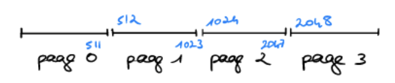
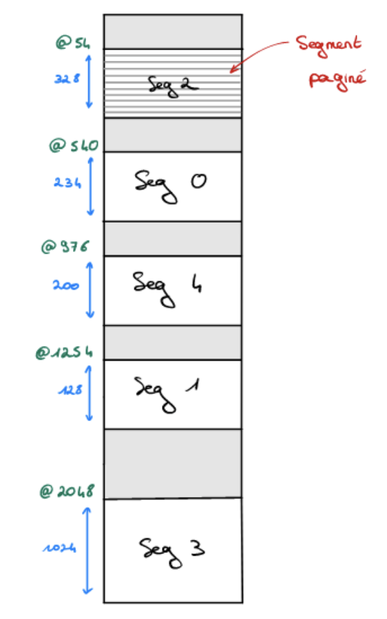

# TD5 - Gestion de mémoire

## Exercice 1

**Swapin:**
  - Unité centrale: Prêt, bloqué
  - Mémoire: Non résident

**Swapout:**
  - Unité centrale: Prêt, bloqué
  - Mémoire: Résident

## Exercice 2

**Swapin:**
  1. Pour un processus prêt:

     - Prêt, on ne sait pas combien de temps les bloqué le seront 
     - La priorité
     - La taille en fonction de la stratégie:
       - Efficacité: On garde les plus petits pour avoir le plus de processus possible dans la mémoire.
       - Sécurité: On garde le plus gros dans le cas où il n'y a plus de place quand on en a besoin.
     - Le *d-swap* pour faire de l'équité
  

  2. Pour un processus bloqué:

     - *d-swap* important (mis sur le disque depuis longtemps)
     - Priorité importante
     - Taille

**Swapout:**

  1. Pour un processus prêt:
     - Bloqué
     - *d-swap* faible
     - Priorité faible
     - Taille
  

  2. Pour un processus bloqué:
     - Priorité faible
     - Taille
     - *d-swap* faible


## Exercice 3

```c
/** sappeur **/

int main (){
  int noProcIn, noProcOut;
  sema reveil_swap = 0;
  int place_en_memoire = 1;

  while (1){
    while(place_en_memoire){ // tant qu'il y a de la place en mem 
      noProcIn = rechercherProcessusArentrer(); // on cherche a entrer des processus

      if (noProcIn < 0) {
        etat_swap = INACTIF; 
        P(reveil_swap); // Si y a rien sema pour endormir le swappeur
      }
      else{
        if(swapin(noProcIn) != 0 ){ // Sinon on rentre dans la mémoire
          place_en_memoire = 0; // Si ret diff 0, y a plus de place
        }
      }
    }

    while(!place_en_memoire){ // tant qu'il y a plus de place
      noProcOut = rechercherProcessusAretirer(); // on cherche des processus à retirer

      if(noProcOut < 0){
        etat_swap = INACTIF;
        P(reveil_swap); // si il y en a pas on endore
      }
      else{
        swapout(noProcOut); // sinon on fait de la place 
        place_en_memoire = 1; // et on le dit
      }
    }
  }
}
```

```c
/** Interuption_horloge_swap **/

if(etat_swap = INACTIF){
  etat_swap = ACTIF;
  V(reveil_swap);
}
```


## Exercice 4

```c
int swapin(int index){
  //allocation mémoire
  char* zMem;
  zMem = allouerZone(processus[index].taille);

  if ((int*) zMem == NULL){
    perror("allouer zone");
    return -1;
  }

  if(lireDisque(processus[index].pt_disque, zMem, processus[index].taille) != 0){
    return -2;
  }

  //mise à jour de la structure processus
  processus[index].etat_mem = RESIDENT;
  processus[index].pt_mem = zMem;
  processus[index].d_swap = time();
  return 0:
}

int swapout(int index){
  if(ecrireDisque(processus[index].pt_disque, processus[index].pt_mem, processus[index].taille) != 0){
    return -1;
  }

  if(libererZone(processus[index].pt_disque, processus[index].pt_mem) != 0){
    return -2;
  }

  processus[index].etat_uc = NON_RESIDENT;
  processus[index].d_swap = time();
  processus[index].pt_mem = NULL;
}
```


## Exercice 5

### Question 1
16 pages &rarr; 512 octets \
4 bits *(num page)* &rarr; 9 bits *(num octets)*

Soit un total de 13 bits

### Question 2
Espqce d'addressage = 6 pages = 3ko \
$6*512 = 3*1024$

### Question 3
4 pages présente en mémoire &rarr; 2ko


## Exercice 6

### Question 1
$2048 = (?,?) = (4, 10) = 4*512+10$

n° page | 9 bits déplacement 
--- | ---
$0100_{(2)}$|$000001010_{(2)}$
$4_{(10)}$|$10_{(10)}$



### Question 2 
Adresse réel, table des pages &rarr;  $(1, 10) = 512+10 = 522$


### Question 3
$512+10 = 522$


## La segmentation 

$(0, 28)$
&darr;
$540+128 = 666$

$(1, 95)$
&darr;
$1254+99 = 1353$

$(2, 465)$
&darr;
$54+$ ~~465~~ &rarr; **Erreur Segmentation**

